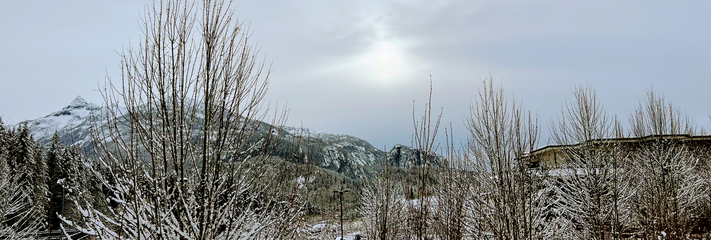

  <h3 align="center">Hi there 🙋🏾‍♂️, I'm Ngoni!</h3>

    <a href="https://nmandiveyi.com">About Me</a>
    ·
    <a href="ngonidzashehh@gmail.com">Email</a>
    ·
    <a href="https://linkedin.com/in/nmandiveyi">LinkedIn</a>
    ·
    <a href="https://twitter.com/ngonimandiveyi">Twitter</a>

#### About
Early career software engineer with 3+ YOE building full-fledged/full-featured web applications. I can do pretty much anything across the SD life cycle with backend and frontend development being my strongest suits. 

#### Skills
* :snake: Python
* :snake: Django
* :snake: Django REST Framework
* :computer: HTML, CSS, JS
* :abacus: Amazon RDS 
* :basket: Amazon S3

#### Quick Facts
- 🔭 I’m currently working on [**Mail Package Manager**](https://github.com/nmandiveyi/mail-package-manager) and [**Tutor's Companion**](https://github.com/nmandiveyi/tutor-companion)
- 🌱 I’m currently learning [**Apache Kafka**](https://kafka.apache.org/documentation/) and **Software Architecture Principles**
- 👯 I’m looking to collaborate on Event Stream driven projects 
- ⚡ Fun fact: I can play Mbira!

 
<h3 align="center">Let's get in touch</h3>

